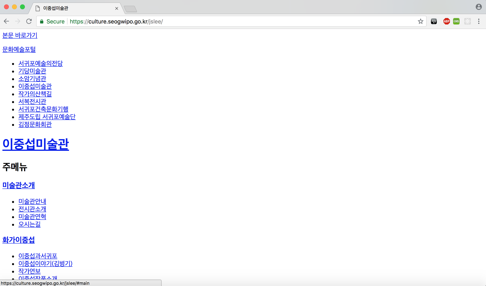
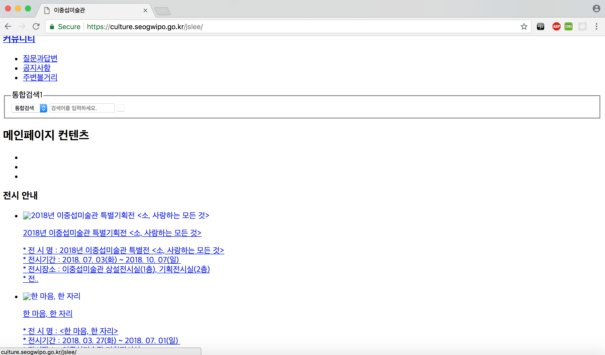
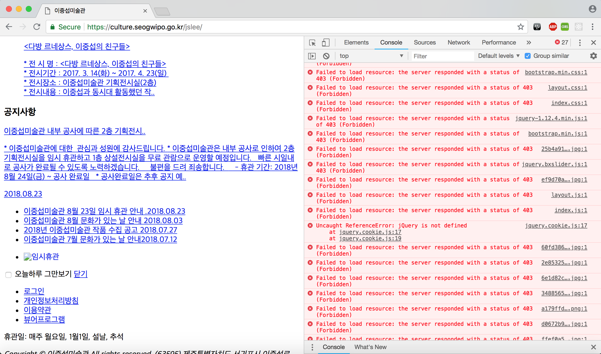

# jslee-musium  
이중섭 미술관 홈페이지 가상 리뉴얼 프로젝트

   
### 프로젝트 개요  

우연한 계기로 이중섭 미술관의 홈페이지에 들어가 보았다.
상상할 수 없는 모습이였다.

이에 한번 가상 프로젝트로 이 홈페이지를 리디자인 하고싶은 마음이 들어 시작하게 되었다.
  
프로젝트는 다음과 같이 진행될 것이다.

 1. 사용자 정의 / 전략 설정
 2. 정보구조 설계
 3. GUI 컨셉
 4. 데모페이지 코딩
   
***이 프로젝트는 개인 프로젝트로 진행되었으며, 학습한 내용을 바탕으로 실습하려는 목적을 띄고 있습니다.
또한 해당 마크다운 레포트의 성격보단 개인적 제작일지의 성격이 강하므로 구조화되지 못하고 어조가 통일되지 않는 등의 문제가 있을 수 있습니다.***

* * *
