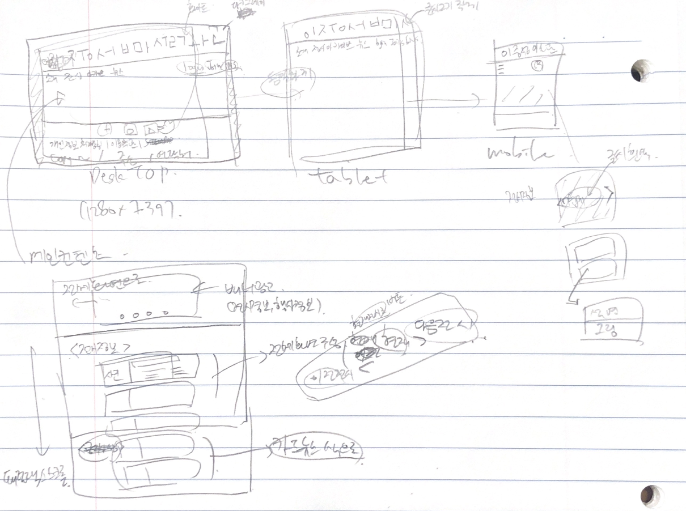

# jslee-musium  
이중섭 미술관 홈페이지 가상 리뉴얼 프로젝트

<br/><br/><br/>
### 프로젝트 개요  

우연한 계기로 이중섭 미술관의 홈페이지에 들어가 보았다.
상상할 수 없는 모습이였다.


이에 한번 가상 프로젝트로 이 홈페이지를 리디자인 하고싶은 마음이 들어 시작하게 되었다.
<br/><br/><br/>
프로젝트는 다음과 같이 진행될 것이다.

#### 1. 사용자 정의 / 전략 설정
#### 2. 정보구조 설계
#### 3. GUI 컨셉
#### 4. 데모페이지 코딩
#### 5. 테스트 평가

<br/><br/><br/>
***이 프로젝트는 개인 프로젝트로 진행되었으며, 학습한 내용을 바탕으로 실습하려는 목적을 띄고 있습니다. 또한 가상 프로젝트 이므로 전체적인 설계과정에 있어 단순화하여 진행한 부분이 많고, 가정에 의해 논리가 진행된 부분이 있음을 알려드립니다. 해당 마크다운 파일은 레포트의 성격보단 개인적 제작일지의 성격이 강하므로 구조화되지 못하고 어조가 통일되지 않는 등의 문제가 있을 수 있습니다.***

<br/><br/>
* * *
<br/><br/>

### 1. 사용자 정의 / 전략 설정

기존 지역주민의 연령분포를 보면, 40대 후반이 가장 많고, 대략적으로 30대 후반에서 50대 후반까지의 주민분포가 가장 크다.
최근 제주도에 20-30대의 젊은 층의 관광객이 늘고 있는 추세다.
타겟이 두 종류로 나눠질 수 있다.


그러나 거주민들의 문화생활 이용도는 3.7%에 불과하다.
반면에 내국인 문화유적 방문지의 43.6%가 이중섭거주지일 정도로 이중섭 거주지가 관광객 사이에서는 유명하다.
따라서 해당 홈페이지의 주요 사용자는 관광객으로 지정하는 것이 더 합리적일 것이다.

앞에서 내국인 관광객의 문화유적 방문지 중에서, 이중섭 거주지의 인기도가 높다는 통계를 보였다.
그러나 그들의 이중섭미술관의 재방문률은 0.2%에 불과했다.


이는 현재 이중섭미술관 이용자들의 사용자 경험이 만족스럽지 못하다는 점을 나타내고 있다. 이는 인터넷과 친구/친지들을 정보의 소스로 주로 활용하는 관광객들에게 좋은 시그널이 되지 못하고, 결국은 사용자의 감소로 이어질 가능성이 크다.

내국인 정보습득경로를 살펴보면, 57.7%가 인터넷을 활용 22.7%가 친구/친지 등을 활용한다는 것이다.


따라서, 유저의 타겟을 20대의 관광객으로 하고,
인터넷과 친구/친지들에게 영향을 많이 받는 그들의 특성을 고려해야 할 것이다.

따라서 이중섭미술관의 홈페이지는 반응형은 기본이고, 소셜 네트워킹의 요소를 포함시키는 방향과, 주 타킷층에게 친숙한 플랫UI를 활용하는 방향으로 개발할 예정이다.


***통계자료는 제주특별자치도 2016년 통계자료를 활용하였다.***

* * *

<br/>

### 2. 정보구조 설계

현재의 사이트 구조는 다음과 같다..

>메인페이지
>> 미술관 소개
>>> 미술관 안내 | 전시관 소개 | 미술관 연혁 | 오시는 길
>>
>> 화가 이중섭
>>> 이중섭과 서귀포 | 이중섭 이야기 | 작가연보 |  작품소개
>>
>> 이중섭 갤러리
>>>작품검색 | 작가검색
>>
>> 전시안내
>>> 현재전시 | 지난전시
>>
>> 창작 스튜디오
>>> 스튜디오 소개 | 입주작가 소개 | 공예공방 소개 | 현재전시 | 다음전시
>>
>> 탄생 100주년
>>> 기념사업 개요 | 추진목적 | 추진사항 | 공지사항
>>
>> 커뮤니티
>>> 질문과 답변 | 공지사항 | 주변볼거리

<br/>
딱 보았을 때, 해당 페이지의 목적이 정보제공에 집중되어 있다는 느낌을 받을 수 있다.
또한 메인 컨텐츠에 있는 전시안내와 공지사항이 네비게이션 안에 각각 2곳씩이나 존재한다는 것은 구조화에 너무 치중하여 효율성을 무시한 것으로 보인다.
또한 이렇게 많은 경로들은 모바일 환경에 최적화된다고 보기는 힘들다.

레퍼런스를 찾으려 다른 미술관 사이트들을 방문해 보았지만, 몇 종류로 구분할 수 있어 보인다.
환기미술관이나 대림미술관 같이 정보제공에 치중되어 있는 곳과,
아트선재센터와 같이 아카이브 형식으로 되어있는 곳이다.


(환기미술관의 경우 플래시로 되어있더라..)


그러나 정보제공을 위주로 구성되어 있는 사이트들 중에서도 서울시립미술관과 같이 글이 많이 없이, 이미지 위주로 구성되어 직관적으로 이해할 수 있는 예제가 있었다.


그러나 2-30대 관광객을 중심으로 타겟팅 하기에는 사이트의 목적을 정보제공에 치중한다기 보단, 흥미유발과 미적 소구요인을 제공하는 것이 더 전략적인 선택같아 보인다. 또한 모바일을 주로 사용하고, 복잡함을 회피하는 경향이 있는 관광객이라는 특성을 반영하여, 필요한 정보는 제공하되, 최대한 간단하게 정보구조를 구성한 결과는 다음과 같다.
<br/>
<br/>

> Main
>> About
>>> 미술관 | 이중섭 | 스튜디오
>>
>> Exhibition
>>
>> Archive
>>
>> News
>>> 공지사항 | Q&A

<br/>
<br/>
위의 내용을 보면 기존의 구조에서 중복을 싹 제거하고, 최대한 간단하게 정보구조를 구성하였다.


* * *

<br/>

### 3. GUI 컨셉

이 부분은 해당 프로젝트의 목적이 디자인이 아니므로 간단한 컨셉만 잡고 들어가는 것으로 한다. 대략적인 페이퍼 프로토타이핑과 어도비 포토샵을 이용하여 대략적인 메인페이지와 메인컨텐츠들을 다음과 같은 레이아웃을 기준으로 구축할 예정이다.


페이퍼 프로토타이핑

비주얼 컨셉


디테일한 부분들을 신경쓰자면 한도끝도 없을 것 같아서, 이러한 디테일들은 코딩하는 과정에서 잡기로 하였다.
물론 이러한 부분이 중요하지 않은 것은 아니지만, 코딩하는 과정에서 이러한 부분들을 수정해 들어가기 위해, 정확한 디자인이 아니라 대략적인 컨셉만 잡고 넘어가는 것이다.

* * *

<br/>
### 4. 데모 페이지 코딩

해당 홈페이지의 데모버전을 구축하기 위해
리액트 라이브러리를 사용했고, 스타일시트는 sass를 사용했으며, 웹팩 모듈 번들러와 eslint 툴을 사용하겠다.
그 외의 패키지 버전은 package.json을 통해 확인하기 바란다.

>package.json

```
  "dependencies": {
    "react": "16.4.2",
    "react-dom": "16.4.2"
  },
  "devDependencies": {
    "@babel/core": "7.0.0",
    "@babel/preset-env": "7.0.0",
    "@babel/preset-react": "7.0.0",
    "autoprefixer": "9.1.3",
    "axios": "0.18.0",
    "babel-cli": "6.26.0",
    "babel-core": "6.26.3",
    "babel-loader": "8.0.2",
    "babel-plugin-transform-class-properties": "6.24.1",
    "babel-polyfill": "6.26.0",
    "classnames": "2.2.6",
    "clean-webpack-plugin": "0.1.19",
    "css-loader": "1.0.0",
    "html-webpack-plugin": "3.2.0",
    "include-media": "1.4.9",
    "node-sass": "4.9.3",
    "open-color": "1.6.3",
    "postcss-loader": "3.0.0",
    "prop-types": "15.6.2",
    "react-icons": "3.0.5",
    "sass-loader": "7.1.0",
    "style-loader": "0.23.0",
    "uglifyjs-webpack-plugin": "1.3.0",
    "webpack": "4.17.1",
    "webpack-cli": "3.1.0",
    "webpack-dev-server": "3.1.7"
  }
}
```
